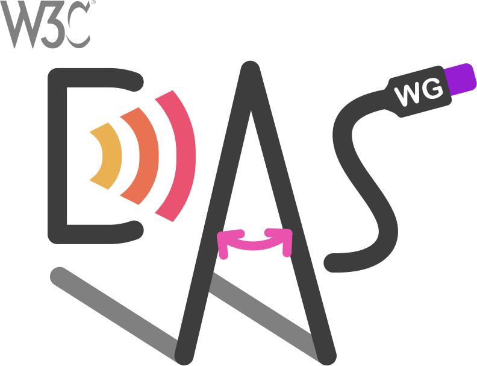

# Device Posture API

## Authors
* [Diego González-Zúñiga](https://twitter.com/diekus) ([Microsoft](https://microsoft.com))
* [Kenneth Rohde Christiansen](https://twitter.com/kennethrohde) ([Intel](https://intel.com))
* [Alexis Menard](https://twitter.com/darktears) ([Intel](https://intel.com))

## Abstract

This document specifies an API that allows web applications to request and be notified of changes of the posture of a device.

## Goals

The device posture is the physical position in which a device holds which may be derived from sensors in addition to the angle. New types of mobile devices are appearing that have some sort of **capabilities that allow them to change their posture**. The most common types of devices are the ones that can fold (their screen or around their screen), allowing them to physically alter their form factor. The **main interest in knowing the posture of a device is to enable new user experiences with responsive design**.

A lot of example of responsive designs can be found [here](https://github.com/foldable-devices/demos).

## Complementary existing proposals:
Before discussing the solution proposal - let's overview existing proposals that are relevant and applicable to the problem space.
As matter of principle we should generally avoid creating redundant concepts if we can reuse existing platform APIs and capabilities.

- [Viewport Segments API](https://wicg.github.io/visual-viewport/#dom-visualviewport-segments) exposes the concept of Viewport Segments, which represent the regions of the window that reside on separate (adjacent) displays or across a seamless folding screen. Because the fold area could be safe or unsafe region to present content, this API lets developers lay around it. In order to target foldable devices it is very likely developers will use the Device Posture API and the Viewport Segments API to build their experiences. This API is also exposed in CSS over [here](https://www.w3.org/TR/mediaqueries-5/#mf-horizontal-viewport-segments).

- [Presentation API](https://w3c.github.io/presentation-api/) is solving the problem of a effective use of a _secondary_ screen and likely won't attempt to solve challenges outlined above that are specific to devices where a window can span separate physical displays. This would likely still be a separate problem for foldables.

- [Screen Enumeration API Explainer](https://github.com/webscreens/screen-enumeration/blob/master/EXPLAINER.md) provides information about the physical screen configuration. Web developers might be able to leverage that on foldables, but would need to do extra effort to correlate that information with window parameters. Some concrete examples on why a special purpose API might be useful in addition to Screen Enumeration:
	- Getting adjacency information about spanning window regions to lay out content in several areas in logical way for a device;
	- Getting inner window dimensions that account for application frame, OS UI elements, etc.

- [Window Placement API Explainer](https://github.com/webscreens/window-placement/blob/master/EXPLAINER.md) is useful in multi-window scenarios on multiple screen devices, but does not target scenarios in which the hosting application (i.e. browser) has a single window which spans multiple displays. In this case, the developer may not wish to open new windows - just hints to help lay out things properly and take advantage of the physical partitioning of the available layout space.

Additionally, while not a solution in the same sense, a ["[css-media-queries] Foldables support and enablement"](https://github.com/w3c/csswg-drafts/issues/4141) issue discusses the problem space and outlines some details and touches upon outlined issues.

## Proposals
### New CSS media query: `device-posture`

We propose a media query that would resolve to a set of fixed postures. These postures consist of a number of predefined values that each encompass a physical state of the device.

Among the values that the device-posture query can take are:
* `folded` (applies to laptop/book postures)
* `continuous` (applies to flat, tablet, or even seamless curved displays)

The API is also flexible enough that we can add new postures if new devices come to the market.

#### Examples

```css
/*using the device in a 'book' posture*/
@media (device-posture: folded) { ... }

```
### New JS object in `window.navigator`: `devicePosture`

The Navigator property of Window [navigator](https://html.spec.whatwg.org/multipage/system-state.html#the-navigator-object) should host device capabilities and system states.

#### Proposed Object
```javascript
DevicePosture : EventTarget {
  readonly attribute DevicePostureType type;
  attribute EventHandler onchange;
}

enum DevicePostureType {
  "folded",
  “...”,
}
```

## Demos
https://github.com/foldable-devices/demos

## Stakeholder Feedback
Mozilla Position: https://github.com/mozilla/standards-positions/issues/882

WebKit Position: https://github.com/WebKit/standards-positions/issues/328

Chrome Status Entry: https://chromestatus.com/feature/5185813744975872

## References & Acknowledgements
Many thanks for valuable feedback and advice from:
* [Daniel Appelquist](https://twitter.com/torgo), [Samsung](https://samsunginter.net) 
* [Jo Balletti](https://twitter.com/thisisjofrank), [Ably Realtime](https://ably.io)
* [Michael Blix](https://twitter.com/mkeblx), [Samsung](https://samsunginter.net) 


